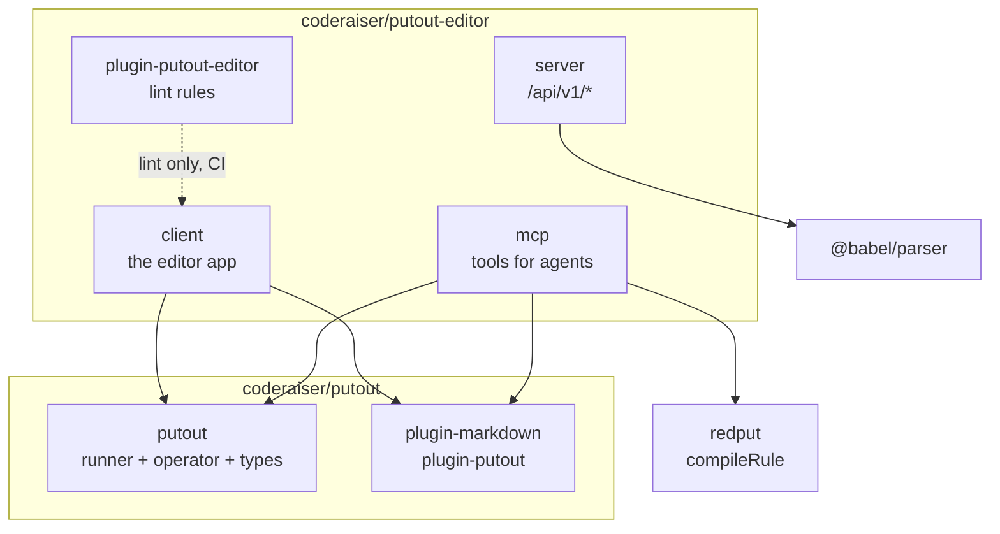
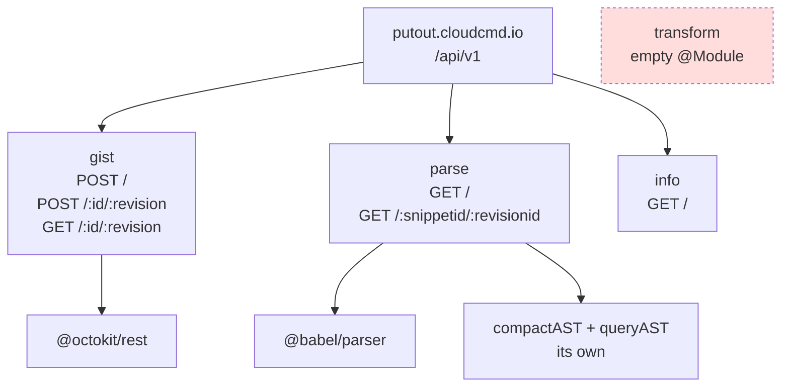
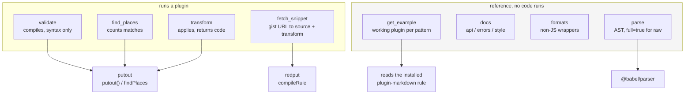

# Architecture

A map, not prose. Read the file you are about to edit; look here only for
where things live and which seam owns what.

## Packages

| Package | What it is |
|---|---|
| `packages/client` | The editor. The app, the redux store, the CodeMirror panels, and all unit + e2e tests. |
| `packages/server` | HTTP API behind `putout.cloudcmd.io` (`/api/v1/*`). |
| `packages/mcp` | MCP server for agents. See its `README.md`; it is independent of the client. |
| `packages/plugin-putout-editor` | 🐊**Putout** rules for this repository. Lint, not runtime — nothing imports it. |

## How the four relate

The interesting part is what is *not* wired. Only two of the four depend on 🐊**Putout** at
all, and the server does not — it has no `@putout/*` dependency and parses over
`@babel/parser` directly. `plugin-putout-editor` is a lint plugin, so it runs in CI and is
invisible at runtime.



Three consequences worth knowing before you move code:

- **The client and the mcp are independent.** They share no source. An agent using the mcp and a
  human using the editor run two separate copies of the same rules.
- **The server is not a thin wrapper over the editor.** It has its own `compactAST`/`queryAST`
  and an empty `TransformModule`, so a change to the client's parser has no server counterpart
  to keep in step.
- **The lint plugin is a package but not a dependency.** Nothing in `client` imports it; it is
  wired through `plugins` in the root `.putout.json`.

## Client

The client's own seams are **enforced**, not conventional: `eslint-plugin-boundaries` builds
its policy from `config/boundaries-config.ts`, and an edge that is not drawn there fails the
lint. Each element is a directory, and an arrow below means "may import".

```mermaid
graph TD
    app["app<br/>composition root"]

    layout["layout"]
    menu["menu"]
    panelSource["panel-source"]
    panelAst["panel-ast"]
    panelTransform["panel-transform"]
    panelCode["panel-code"]

    editorSource["editor-source"]
    editorTransform["editor-transform"]
    editorResult["editor-result"]
    editorAstJson["editor-ast-json"]
    editorAstTree["editor-ast-tree"]
    editor["editor<br/>qword wrapper"]
    ui["ui"]
    snippet["snippet"]
    store["store"]
    parser["parser"]

<!-- gen:client-imports -->

    app --> layout
    app --> menu
    app --> panelSource
    app --> panelAst
    app --> panelTransform
    app --> panelCode

    editor --> parser
    store --> editor
    store --> parser
    store --> snippet
    parser --> editor
    parser --> store
    snippet --> editor
    snippet --> store
    snippet --> parser
    ui --> editor
    ui --> store
    ui --> parser
    editorSource --> editor
    editorSource --> store
    editorSource --> parser
    editorResult --> editor
    editorResult --> editorAstJson
    editorAstJson --> editor
    editorTransform --> editor
    editorTransform --> editorResult
    editorTransform --> store
    editorTransform --> parser
    editorTransform --> ui
    editorAstTree --> editor
    editorAstTree --> editorAstJson
    editorAstTree --> store
    editorAstTree --> parser
    editorAstTree --> snippet
    panelSource --> editorSource
    panelSource --> ui
    panelSource --> store
    panelAst --> editorAstTree
    panelAst --> ui
    panelAst --> store
    panelTransform --> editorTransform
    panelTransform --> store
    panelCode --> editorResult
    panelCode --> store
    panelCode --> parser
    layout --> panelSource
    layout --> panelAst
    layout --> panelTransform
    layout --> panelCode
    layout --> ui
    menu --> editorTransform
    menu --> parser
    menu --> snippet
    menu --> store

<!-- /gen:client-imports -->

    style app fill:#eee
```

Two things that read off the graph and are not obvious from the files:

- **`store` and `parser` import each other.** That is deliberate: `parserSelectors.ts` and
  `parserMiddleware.ts` live in `store/` precisely because they take a `RootState`, and the
  reciprocal edge is what keeps the pair from becoming a cycle through directories.
- **`menu` is a leaf.** Nothing may import it, which is why the shared `ToolbarMenuContext`
  lives in `store/` and not next to the menu that uses it.

The `app` node draws six of its edges, but its policy is `['*']` — it may import any element.
It is drawn with the ones it actually uses, so the graph reads top-down.

**The arrows between the `<!-- gen:client-imports -->` markers are generated, and the check is
part of the lint.** `scripts/gen-diagrams.mjs` reads the map out of
`packages/client/config/boundaries-config.ts` — the same map `boundaries/dependencies`
enforces — and rewrites that block; `bun run lint` regenerates in memory and fails if the file
is stale. The node declarations, labels and `style` lines stay hand-written, because those are
prose and do not drift.

This caught real drift the first time it ran: the hand-drawn diagram was missing three edges the
policy has always allowed — `ui → editor`, `store → snippet` and `snippet → editor`. Nothing
had complained, because the diagram was a second statement of the policy and only one of the two
was enforced.

The other three diagrams in this file are **not** generated, and that is a deliberate gap rather
than an oversight: the server and mcp graphs come from reading those packages, and the
putout counts in [`putout-map.md`](./putout-map.md) need a checkout of the sibling repository
that CI does not have. A generated block nobody regenerates is a worse thing than a written one,
so they stay written and stay honest about it.

## Client data flow

```
parser category  →  parse (src/parser)          →  workbench.code / parseResult
transform plugin →  transform (src/transformer) →  workbench.transform
                     ↓
        panels read the store, never each other
```

- `src/store` — the redux layer, in three concerns. `state.ts` holds the state types
  and `initialState`, `revive.ts` the persistence (`persist`/`revive`, and `revive()`
  derives `initialCode`/`parserSettings` from other state — see its JSDoc), and
  `reducers.ts` the slice itself. **`index.ts` is the barrel**, and it is the only way in
  from outside the directory: it re-exports the state types and `persist`/`revive`
  straight from the file that defines each, so `reducers.ts` holds nothing but the slice.
  That used to be the other way round — `reducers.ts` was both the slice and the barrel,
  and 26 of its 42 importers reached past the barrel to get a type, which is why it was
  the second most-touched file in the repository. Inside `src/store`, imports still come
  from the defining file, because going through the barrel there is a cycle.
  `parserSelectors.ts` and `parserMiddleware.ts` live here too, not under `parser/`,
  because they take a `RootState` — that is what keeps `store → parser` one-way.
- `src/app` — the composition root, one concern per file: `createStore.ts` builds the
  store and its middleware chain, `persistence.ts` the debounced write, `handlers.ts`
  the hash and unload handlers, `debounce.ts` the debouncer. Each takes what it needs
  as an argument, so `src/app.tsx` is a thin entry and every piece is spec-able without
  a DOM or a real store.
- `src/parser` — one directory per parser category, each exporting
  `id`/`displayName`/`mimeTypes`/`fileExtension`. `fileExtension` is what decides the
  source filename for a stored snippet. `parsers/index.ts` registers the adapters;
  each one has a spec beside it.
- `src/transformer` — compiles a plugin string and runs it. `init-plugin.ts` is the
  compile entry.
- `src/panel-*` — render only. They read the store and dispatch actions; they never
  reach into each other. Each has its own spec.
- `src/snippet` — New-menu templates + fixtures, the share dialog, and
  `storage/` (the `gist.ts` backend plus `api.ts`, which is just
  ``fetch(`${API_HOST}/api/v1${path}`)``). A stored snippet is
  `astexplorer.json` (manifest) + `transform.js` + the source — `code.js` when
  `v === 1`, `source.<ext>` when `v === 2`.

## Server

NestJS, four modules, and it does **not** use 🐊**Putout**. `parse` is `@babel/parser` plus its
own `compactAST`/`queryAST`; `transform` is an empty `@Module({})`; `redput.d.ts` declares a
module that nothing imports.



The `transform` module is drawn dashed because it is a real module that does nothing — worth
knowing before you go looking for a transform endpoint and assume you missed it.

## MCP

Eight tools over one process, grouped by what they actually do. Four run a plugin; the rest are
reference or IO.



`get_example` is the one to trust least on its own: its examples are hand-written, and the
markdown one already drifted, so it now reads the shipped rule and a spec pins the two
together. `docs {section: 'style'}` is the convention half — names, package shape, rule shape,
imports, tests — for code that has to look like it came out of `coderaiser/putout`.

## Tests

| Location | Runner | Scope |
|---|---|---|
| `src/**/*.spec.{ts,tsx}` | tape / supertape | unit. One assertion per test, so bind both sides to consts first. |
| `test/**/*.spec.ts` | tape | specs for the shared test helpers. `test/**` is excluded from coverage. |
| `e2e/**/*.ts` | Playwright | end to end, against the **prebuilt** bundle in `../../out`. |

Shared fixtures belong in `test/store.ts` (`#test/store`), not in a per-spec copy.

**Every spec shares one process and one DOM.** tape runs the whole glob in a single
node process, so a spec that mounts a tree or installs a global leaks into every spec
after it. `src/app.spec.tsx` imports the real entry, so it removes its container and
restores `onhashchange`/`onbeforeunload` when it finishes; without that teardown the
suite went from green to 104 failures ("multiple elements with the role button",
`ECONNREFUSED` from a live snippet load).

## Lint rules

| Package | Holds |
|---|---|
| `packages/plugin-putout-editor` | 🐊**Putout** rules for *this* repository, wired in through `plugins` in the root `.putout.json`. See `docs/plugins.md` for how to add one |
| `packages/mcp` | the mcp server; its `get_example('markdown')` now reads the installed rule rather than a copy |

Two kinds of rule live in that plugin, and the difference matters. A **code** rule
(`apply-press-modifier-case`) sees one AST and runs under `putout .`. A **filesystem** rule
(`remove-rgb-outside-tokens`) is built on `matchFiles` and needs the filesystem AST, so it only
runs under `redlint` — which `packages/client` does in its `fix:lint`.

That split is 🐊**Putout**'s design, not a workaround: a rule deliberately knows nothing about
filenames, so anything that is a statement about a *tree* (colours only in `tokens.css`, no
`console.log` in `src/`) has to be expressed against a tree. `docs/plugins.md` covers adding
one; `docs/issues/` holds the findings.

## Coverage

`.nycrc.json` — **not** `.c8rc`; `c8` reads nyc config, so that is where the client's
thresholds live (`checkCoverage`, 100% on all four metrics, `all: true`).

Its `exclude` list named twelve source paths that were exactly the files that were
uncovered, so the 100% was 100% of whatever was left — 92 files, and not a number
that could be trusted. It is fixed: the list is now eleven named files with a
stated reason each, and `bun run coverage` reports a real 100% over the 115 files
it measures. See the finding below for the eleven.

### e2e projects

Each Playwright project runs a specific set of files — a test in the wrong file
silently never runs:

| Project | Files |
|---|---|
| `desktop-chrome` | `desktop.ts`, `editor-desktop.ts`, `snippet.ts`, `visual.ts` |
| `desktop-chrome-dark` | `visual.ts` |
| `mobile-safari` | `mobile.ts`, `editor-mobile.ts` |

`e2e/desktop/` and `e2e/mobile/` are helper modules, not test files. They do not
match any project's `testMatch`, so putting a spec there would run it zero times.
