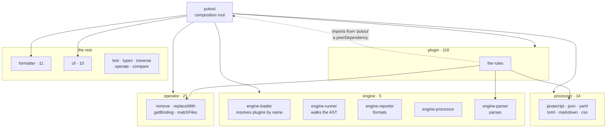
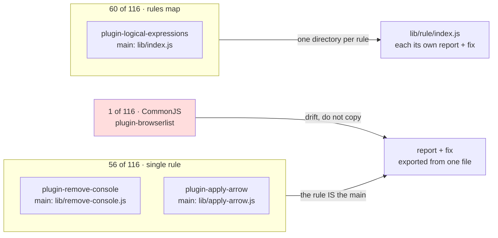

# 🐊**Putout** repository map

A map of `coderaiser/putout` as it stands, measured rather than remembered: **188 packages**,
**116 plugins**, **622 rules**, **770 rule files**. Every number here came out of the tree, and
the method is in [How this was measured](#how-this-was-measured) so a future reader can disagree
with it.

For how to *write* a plugin in the house style, read
[`putout-style.md`](./putout-style.md). This file is the map; that one is the manual.

## The shape of the whole

Two things are worth knowing before reading further.

**`putout` is the composition root, not a library.** It depends on almost everything and nothing
depends on it, so a "layering violation" scan run naively will light up on it. Read the arrows
*down* from `putout`, not across the graph.

**A plugin depends on nothing.** 114 of 116 plugins declare **zero** runtime dependency on any
sibling `@putout/*` package. The only two that do are `plugin-filesystem` (→ `operator-filesystem`,
`operator-json`, `operate`) and `plugin-printer` (→ `plugin-putout`). A rule imports from
**`putout` itself**, which is a `peerDependency` (`">=41"` or `">=42"`), never from a neighbour.
That is the single most load-bearing convention in the repository — see
[`putout-style.md`](./putout-style.md).

## Layers

| Layer | Count | What it is |
|---|---|---|
| `plugin-*` | 116 | the rules — this is what a contributor usually adds |
| `operator-*` | 21 | `NodePath` surgery shared by many rules |
| `processor-*` | 14 | a language: parse it, print it |
| `formatter-*` | 11 | output shapes for the CLI |
| `cli-*` | 10 | argv, file walking, watch, staging |
| `engine-*` | 5 | the runner: load, walk, report, process, parse |
| core | 6 | `putout`, `test`, `types`, `traverse`, `operate`, `compare` |
| eslint | 4 | the eslint bridge and configs |
| babel-plugin | 1 | `babel-plugin-putout` |

## Edges

**288 plugin → local `@putout/*` edges**, of which **4 are runtime** and **284 are dev**. The dev
edges are what makes a plugin look connected when it is not; a rule's actual imports are almost
always just `putout`.

Most-referenced local packages, counting all edge kinds:

| Referenced by | Package |
|---|---|
| 116 | `test` (every plugin's harness is `@putout/test`) |
| 81 | `eslint-flat` |

## The two package shapes

A plugin is one of three shapes, and **48% are the first one**.

| Shape | Count | `main` | Use when |
|---|---|---|---|
| **single** | 56 | `lib/<rule>.js` | the plugin *is* one rule |
| **multi** | 60 | `lib/index.js` exporting `rules = {…}` | the plugin groups related rules |
| **CJS index** | 1 | `lib/index.js` with `module.exports.rules` | `plugin-browserlist` only — drift, do not copy |

For a single-rule plugin the rule name is the package name minus the prefix: `plugin-apply-arrow`
→ `lib/apply-arrow.js` → the rule `apply-arrow`. **55 of 56** follow that exactly; the one that
does not is `plugin-typescript`, whose `main` is `lib/export.js`, an aggregator.

### Multi-rule plugins, by size

| Rules | Plugins | Examples |
|---|---|---|
| 1 | 6 | a group that never grew past one rule — a candidate to *become* a single-rule plugin |
| 2–7 | 30 | `plugin-gitignore` (2), `plugin-logical-expressions` (4), `plugin-react-hooks` (9) |
| 8–14 | 12 | `plugin-destructuring` (12), `plugin-sql` (14), `plugin-github` (12) |
| 15–31 | 9 | `plugin-minify` (18), `plugin-conditions` (19), `plugin-esm` (22) |
| 32+ | 3 | `plugin-tape` (39), `plugin-putout` (90) |

The median multi-rule plugin holds 7 rules. There is no style guide number, because there is no
threshold at which a group is wrong — but a 1-rule `lib/index.js` is a shape with no advantage,
and a new plugin should not start there.

## The five rule shapes

Across 770 rule files, by what they export:

| Exports | Count | Share |
|---|---|---|
| `fix` | 409 | every fixable rule |
| `replace` | 359 | a replacement map or a one-shot replacer |
| `traverse` | 290 | the dominant way to find a place |
| `match` | 162 | a replacer's gate |

## Rules that are not plain rules

- **Off by default.** 63 rules across 15 plugins are declared `'rule-name': ['off', Rule]`. The
  commonest are opinionated or domain-specific: `optional-chaining/convert-logical-to-optional`,
  `nodejs/convert-esm-to-commonjs`, `coverage/remove-files`.
- **Namespace-nested.** 16 rules in 2 plugins use a `/` in the rule name and nest the directory
  to match: `postgres/convert-serial-to-identity`,
  `convert-sqlite-to-postgres/apply-key-exists`. Only `plugin-sql` (13) and `plugin-nodejs` (3)
  do this, and both have a real reason — the first segment is a *dialect*, so the same
  conversion can exist twice.
- **Declarator.** `plugin-declare` exports no `rules` map at all. It exports a `declare()`
  returning a name → import-string map, which is what lets a fixer *insert* an import rather
  than assume one.

## Tests

Universal without exception:

- **116 / 116** use `@putout/test`'s `createTest`. Seven plugins also have bare `supertape`
  files for things `createTest` cannot express (filesystem fixtures, `matchFiles`).
- **116 / 116** carry a `README.md`, a `.nycrc.json` and a `.npmignore`.
- **113 / 116** carry `.madrun.js`, `eslint.config.js`, and a `test/fixture/` directory. Every
  one of those 113 has at least one `-fix` fixture.
- **115 / 116** carry a `LICENSE` (`plugin-printer` does not).
- **91 / 116** carry a `.putout.json`; the 25 without are largely the framework plugins that lint
  themselves from the root.

Of 2035 fixture files, **816 have a `-fix` twin and 203 do not** — and the ones that do not are
not orphans. They are the negative cases, and their names say so: `not-valid.js`, `long.js`,
`two-args.js`, `no-overrides.js`, `for-of.js`. They are read by `t.noReport` / `t.noTransform`,
which assert the rule *does not* fire, so there is nothing to fix. So the convention is
narrower than "every fixture has a twin":

> a fixture a **transform** asserts on has a `-fix` twin; a fixture a **`not*`** asserts on does
> not.

The trap is that the two are otherwise indistinguishable from the filesystem, and a count of
"fixtures without twins" looks like 203 dead files when it is 203 negative cases. That is a
correction to an earlier version of this document, which said every fixture has a twin.

Test names follow `putout: <rule>: <what>`, where `<what>` is `report`, `transform`,
`no report: <case>` or `no transform: <case>`. A rule that must *not* fire on something names
that case, so the negative is a test rather than an assumption.

## README convention

Every plugin's README is the same five-part shape: title with the npm badge, a one-line
description, `## Install`, the `rules` JSON a user pastes into `.putout.json`, then a section per
rule with an ❌/✅ code pair. **111 of 116** use ❌ and **114 of 116** use ✅; the five that do not
(`plugin-browserlist`, `plugin-docker`, `plugin-github`, `plugin-goreleaser`, `plugin-travis`)
are the ones with no code example to show.

## How this was measured

Everything above is a count over the tree, not a reading of the docs. The three passes:

1. **Shape** — `package.json` `main` decides single vs index; `lib/index.js` is parsed for the
   `rules` map, handling `'key': Rule`, `'key': ['off', Rule]` and the shorthand `key,` form.
2. **Rules** — every `lib/**/*.js` is scanned for `export const report`; a file that has it is a
   rule, and the rest of its exports classify it.
3. **Edges** — `dependencies` and `devDependencies` are read separately, and only names matching
   an existing sibling directory count as edges.

The counts to distrust are the ones that needed a judgement call: the 770 "rule files" figure
includes rules imported by other rules as building blocks, so it is larger than the 622 rule
names a user can switch on. The gap is the interesting part — it is composition.

## What does not survive contact with the map

Three plugins do not follow the conventions and none of them is a model to copy:

- `plugin-browserlist` — the only CommonJS plugin (`'use strict'`, `require`, `module.exports.rules`).
- `plugin-browserlist`, `plugin-convert-is-nan-to-number-is-nan`, `plugin-convert-spread-to-array-from`
  — the only three with no `.madrun.js`, though all three call `madrun` in `package.json`.
- `plugin-typescript` — `main` is `lib/export.js`, an aggregator, so its rule names do not
  follow from the package name.

Drift is drift. When a rule looks like one of these, check whether it has a reason — `plugin-sql`'s
nested names do, `plugin-browserlist`'s CJS does not.

| `filter` | 62 | narrow an includer |
| `include` | 57 | name the node types to visit |
| `scan` | 50 | filesystem rules |
| `exclude` | 22 | skip subtrees |
| `find` | 8 | advanced; a `find` with no `fix` throws in the normal runner |
| `rules` | 1 | a rule that ships other rules |
| `declare` | 1 | a declarator |

**`traverse` + `fix` is the house default** — 290 of 770 files, and the shape to reach for unless
the rule is a pure textual substitution. `replace` is high (359) mostly because rules compose
other rules by importing their `replace`; it is a building block more often than a whole rule.

| 10 | `plugin-putout` (rules *about* putout) |
| 8 | `plugin-variables`, `plugin-declare` |
| 7 | `plugin-declare-before-reference` |
| 6 | `plugin-nodejs`, `plugin-tape` |

`@putout/test` being universal is why every plugin can be tested the same way, and
`plugin-declare` / `plugin-declare-before-reference` being next is why a *new* plugin usually
starts by declaring the imports its own fixtures need.
